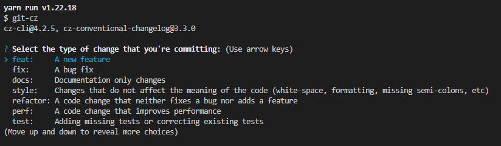
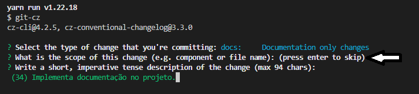
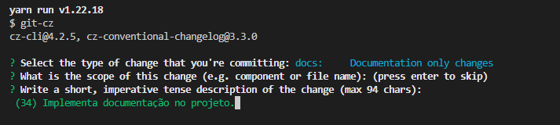
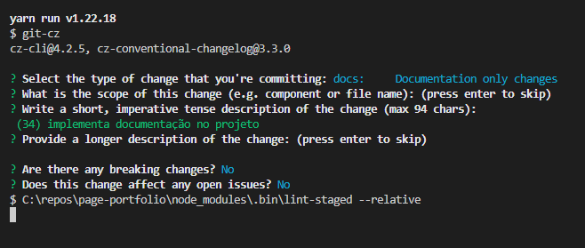

# Branches

As branches principais são:

- **main**
- **develop**

## Regras para novos desenvolvimentos:

- _feature/[nome-da-feature]/main_ - Para trabalhos relacionados a uma estória, derivar a branch a partir da **develop** com nome relacionado (Ex.: \*\*feature/tela-selecionar-local/main)
- _feature/[nome-da-feature]-[nome-da-tarefa]_ Para trabalhos relacionados a uma tarefa, derivar a branch a partir da **feature branch**, com nome relacionado (Ex.: _feature/tela-selecionar-local/configurar-api_)
- _hotfix/[nome-da-correcao]_ - Para trabalhos relacionados à correção de um bug/problema em produção, derivar a branch a partir da **main** com nome relacionado (Ex.: _hotfix/correcao-filtro-locais_)

### Observações

- Após integrar uma branch de **hotfix** na branch **main**, sempre integrá-la também na branch **develop**
- O time poderá sugerir mudanças nessas regras periodicamente
- Em casos específicos, o time pode decidir utilizar uma regra diferente que mais se atende à necessidade

## Commit

```shell
yarn run commit
```

<div style="background: black; padding: 12px;">
<h3>Deve escolher qual tipo vai ser o commit:</h3>
</br>
<p align="center" >
  <a href="https://unform.dev">
    
  </a>
</p>
</div>

<div style="background: black; padding: 12px; margin-top: 10px;">
<h3>Deve teclar enter no "scope":</h3>
</br>
<p align="center" >
  <a href="https://unform.dev">
    
  </a>
</p>
</div>

<div style="background: black; padding: 12px; margin-top: 10px;">
<h3>Deve preencher a mensagem do commit:</h3>
</br>
<p align="center" >
  <a href="https://unform.dev">
    
  </a>
</p>
</div>

<div style="background: black; padding: 12px; margin-top: 10px;">
<h3>No próximo deve preencher a descrição ou techar enter para passar:</h3>
</br>
<p align="center" >
  <a href="https://unform.dev">
    
  </a>
</p>
</div>

<div style="background: black; padding: 12px; margin-top: 10px;">
<h3>Nos dois últimos deve responder "N" para completar o commit:</h3>
</br>
<p align="center" >
  <a href="https://unform.dev">
    
  </a>
</p>
</div>

# Padrões de Código e Organização

- Será utilizado Typescript como linguagem de programação padrão.
- Os warning são tratados como erro.
- A formatação do código fonte é automatizada pelo Prettier (arquivo de configuração do plugin será versionado junto com o projeto).

## Estrutura de pastas do projeto

O nome das pastas estruturais do projeto devem iniciar com letra minúscula.

```text
  - components
  - pages
  - assets
```

A organização de arquivos do projeto será feita por **features**

- public
  - icon
    - icon.svg
  - image
    - image.svg
- src
  - components/
  - Botao/
    - Botao.tsx
    - Botao.spec.tsx
    - Botao.styles.tsx
    - Botao.styles.spec.tsx
    - index.ts
  - context/
    - Context/
      - Context.reducer.spec.ts
      - Context.reducer.ts
      - Context.Actions.ts
      - Context.context.spec.tsx
      - Context.context.tsx
  - hooks/
    - useApi/
      - useApi.ts
      - useApi.spec.ts
  - infrastructure
    - api/
      api.ts
  - resources/
  - cores.ts
  - fonts.ts
  - services/
    - service/
      - index.ts
      - service.service.spec.ts
      - service.service.ts
  - types/
    - enums/
      - Enum.ts
    - Type.ts
  - index.ts

## Pastas

O nome das pastas dos componentes seguem o padrão **_Kebabcase_**

```text
  execucao-servico
```

## Componentes

O nome das pastas dos componentes seguem o padrão **_Pascalcase_**

```text
  Botao
```

O nome dos componentes seguem o padrão **_Pascalcase_** e deverão ter a extensão tsx do Typescript

```text
  OrdensDeServicoAbertasPage.tsx
```

Os componentes devem ser exportados como _default_ nos respectivos arquivos index.ts

```ts
import MeuComponente from './MeuComponente';

export default MeuComponente;
```

ou

```ts
export * from './MeuComponente';
```

## Interfaces

As interfaces no Typescript deverão começar com `I`. ex.: `OrdemDeServico`

```typescript
export interface IOrdemDeServico {
  nome: string;
}
```

## Ícones e imagens SVG

Antes importar os itens SVG do figma usar esse site https://jakearchibald.github.io/svgomg/ para otimizar o SVG.

> Obs: Deixar as configurações padrão e habilitar a opção Prefer viewBox to width/height

```typescript
import Logo from '@assets/images/logo.svg';

export default function MeuComponente() {
  return <Logo />;
}
```

### Testes

Os testes dos styled components serão feitos usando snapshot quando o estilo é fixo.

```typescript
import Home from '../src/app/page';
import '@testing-library/jest-dom';
import {render, screen} from '@testing-library/react';

test('Home DEVE ser igual ao snapshot', () => {
  const {container} = render(<Home />);
  expect(container).toMatchSnapshot();
});
```
